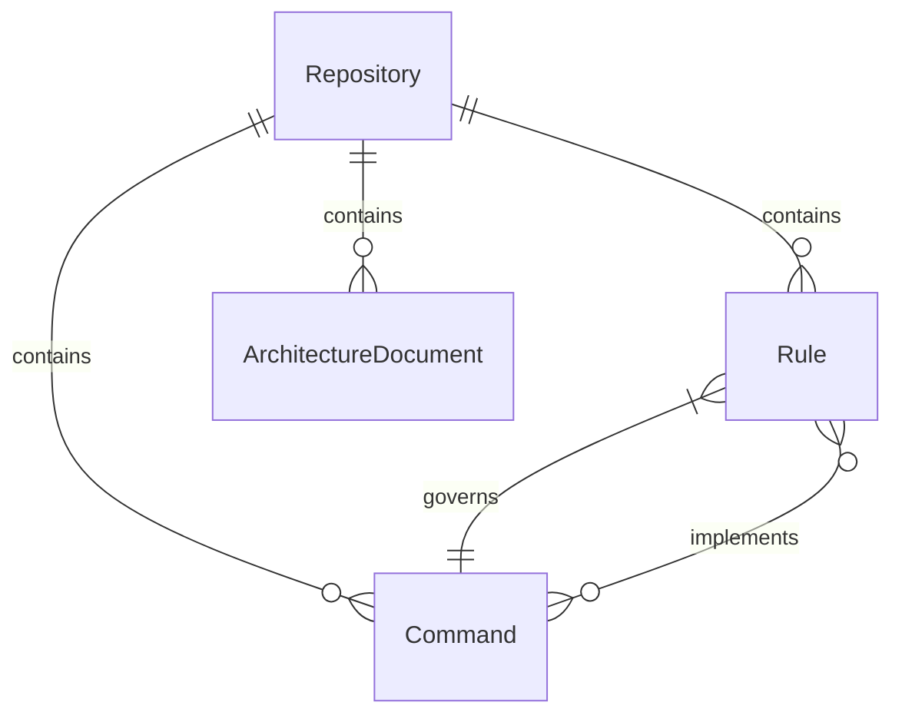

# hl_overview

High level overview of the codebase

# Project Analysis

## Repository Name
[[repo-swarm-sample-results-hub_b3a63fa5]]

## Project Purpose
This appears to be a project focused on architectural documentation and rule management, possibly serving as a hub for collecting and managing architectural documentation samples or results. The presence of multiple `.arch.md` files suggests it's a centralized location for architectural specifications or documentation.

## Architecture Pattern
Documentation-centric architecture with a rules-based structure. The `.cursor` directory suggests a specialized tooling pattern for managing architectural documentation.

## Technology Stack
Based on the available files, this appears to be primarily a documentation-focused project. No specific programming language dependencies are identified as there are no traditional package management or dependency files present.

## Initial Structure Impression
The project is organized into two main parts:
1. Root-level architectural documentation files (`.arch.md` files)
2. A `.cursor` directory containing rules and commands for documentation management

## Configuration/Package Files
No traditional configuration or package files are present. The main configuration appears to be through:
- `.cursor/rules/*.mdc` files
- `.cursor/commands/report.md`

## Directory Structure
```
Root/
├── .cursor/
│   ├── rules/         # Documentation rules and constraints
│   └── commands/      # Command definitions
└── [Root Level]       # Various architectural documentation files
```

## High-Level Architecture
The project employs a documentation-management architecture with:
1. **Rules Engine**: Implemented through `.cursor/rules/`
2. **Command System**: Managed via `.cursor/commands/`
3. **Documentation Store**: Multiple `.arch.md` files at root level

## Build, Execution and Test
Without traditional build or test configuration files, this appears to be a documentation repository that likely:
1. Uses the `.cursor` directory's rules for validation
2. Implements commands through the `commands/report.md` file
3. Main entry points appear to be the various `.arch.md` files

The project seems focused on documentation management rather than software execution, with emphasis on architectural documentation organization and rule enforcement.

# module_deep_dive

Deep dive into modules

I'll analyze each component based on the repository structure provided. However, I notice this appears to be a documentation/architectural repository containing mainly architectural documentation files (`.arch.md`) and some configuration rules.

Let's break down the main components:

## 1. Root Directory (/)

**Core Responsibility:**
- Serves as a central hub for architectural documentation and specifications
- Houses multiple architecture definition files for different projects/components

**Key Components:**
- Architecture Definition Files (*.arch.md):
  - `repo-swarm.arch.md`
  - `open.arch.md`
  - `test-repo-1.arch.md` & `test-repo-2.arch.md`
  - `is-even.arch.md`, `is-odd.arch.md`, `is.arch.md`
- `README.md`: Project documentation and overview
- `LICENSE`: Project license information

## 2. .cursor Directory

**Core Responsibility:**
- Contains configuration and rules for the project tooling
- Manages special commands and rule definitions

**Key Components:**
1. rules/ directory:
   - `special-tooling.mdc`: Defines special tooling configurations
   - `ignore-reports-folder-for-queries.mdc`: Query filtering rules
   - `report-and-query-placement.mdc`: Rules for report/query organization

2. commands/ directory:
   - `report.md`: Command definitions for reporting functionality

**Dependencies & Interactions:**
- This appears to be a self-contained documentation repository
- No direct code dependencies observed
- Main interactions seem to be between:
  - Architecture definition files (*.arch.md)
  - Rule configurations in .cursor/rules/
  - Command definitions in .cursor/commands/

Additional Notes:
- The repository appears to be focused on architectural documentation rather than implementation code
- The .cursor directory suggests some form of automated documentation or analysis tooling
- The multiple architecture files suggest this might be a hub for collecting and managing architectural specifications across multiple related projects

# dependencies

Analyze dependencies and external libraries

# Dependency and Architecture Analysis

Based on the provided repository data, I'll conduct an analysis focusing only on what can be definitively determined from the given information.

## Analysis Summary

The provided repository appears to be primarily documentation-focused, containing mainly markdown files and configuration rules. No source code directories or dependency files were identified in the provided structure.

## Internal Modules

Given the repository structure, I can only identify the following organizational components:

- `.cursor/` - Configuration directory
  - `rules/` - Contains rule definitions
  - `commands/` - Contains command definitions

## External Dependencies

Based on the provided dependency list section marked "No dependency files found!", I cannot identify any external dependencies for this project.

## Additional Notes

1. The repository appears to be primarily documentation-focused, containing multiple `.arch.md` files
2. The primary configuration appears to be centered around `.cursor` tooling
3. No traditional source code structure or package management files were identified in the provided data

**Important**: This analysis is intentionally limited to only what can be definitively determined from the provided repository structure and dependency information. Any additional architectural components or dependencies would require additional data to verify.

# core_entities

Core entities and their relationships

Based on the repository structure provided, I'll analyze the domain models and entities. However, I notice this appears to be a repository focused on architectural documentation and rules, rather than a typical application codebase. Nevertheless, I'll identify the key entities that emerge from this structure.

# Domain Entities Analysis

## 1. Core Entities

### Rule
- **Key Attributes:**
  - name
  - content/description
  - path/location
  - type
- **Relationships:**
  - One-to-many with Commands (Rules can be associated with multiple commands)

### Command
- **Key Attributes:**
  - name
  - description
  - implementation details
  - associated rules
- **Relationships:**
  - Many-to-many with Rules (Commands can have multiple rules, and rules can apply to multiple commands)

### Repository
- **Key Attributes:**
  - name
  - architecture documentation
  - license information
  - readme content
- **Relationships:**
  - One-to-many with Rules (A repository can have multiple rules)
  - One-to-many with Commands (A repository can have multiple commands)

### ArchitectureDocument
- **Key Attributes:**
  - name
  - content
  - type/category
  - associated repository
- **Relationships:**
  - Many-to-one with Repository (Multiple architecture documents belong to one repository)

## 2. Entity Relationships



This analysis is based on the repository structure and common patterns in architectural documentation systems. The entities identified represent the core domain models that appear to be central to this project's organization and functionality.

# DBs

databases analysis

After analyzing the provided repository structure and files, I can conclude:

"no database"

This conclusion is based on:
1. The repository appears to be primarily documentation-focused, containing mainly markdown files (`.md`, `.mdc`)
2. There are no visible database configuration files, connection strings, or ORM definitions
3. No SQL scripts, schema definitions, or migration files are present
4. No evidence of database client libraries or database-related dependencies
5. The repository structure suggests it's focused on architecture documentation and rules/commands rather than application code that would interact with databases

# APIs

APIs analysis

After analyzing the provided repository structure, I don't see any source code files that would contain HTTP API endpoints. The repository appears to contain primarily markdown documentation files (`.md`, `.arch.md`) and some configuration files under the `.cursor` directory.

Therefore, I must return:

no HTTP API

Note: The repository seems to be focused on architectural documentation and configuration rather than containing actual API implementation code. If you'd like me to analyze API endpoints, please provide a repository that contains actual source code files (e.g., `.js`, `.py`, `.java`, etc.) that implement HTTP endpoints.

# events

events analysis

After analyzing the provided repository structure, I can conclude that:

no events

Explanation: The provided codebase appears to be primarily documentation and configuration files (.arch.md, .md, .mdc) without any actual application code that would contain event-producing or event-consuming logic. There are no source code files showing interactions with message brokers, event buses, or event-driven architectures.

# service_dependencies

Analyze service dependencies

Based on the provided repository structure, I notice several limitations in performing a complete dependency analysis:

1. This appears to be primarily a documentation repository containing various `.arch.md` files and some configuration files under `.cursor/` directory.

2. I don't see any traditional application code files (like .py, .js, .java, etc.) or dependency management files (requirements.txt, package.json, etc.).

3. The repository seems to be focused on architectural documentation rather than actual application code.

## Dependencies Analysis

Given the nature of this repository, I can only identify the following:

### Direct Dependencies

None identifiable from traditional dependency files or application code.

### Implicit Dependencies

1. **Cursor Tool Infrastructure**
   - Type: Development Tool
   - Purpose: Based on the `.cursor` directory structure, this repository appears to depend on some kind of Cursor-related tooling for processing architectural documentation
   - Integration Point: `.cursor/` directory containing rules and commands
   - Note: This is an ASSUMPTION based on directory structure; further investigation would be needed

### Additional Notes

1. This appears to be a documentation-focused repository, possibly part of a larger system for managing architectural documentation.

2. To perform a more complete dependency analysis, we would need:
   - Access to any actual application code if it exists
   - Any build configuration files
   - Any package manager configuration files
   - Any deployment configuration files

3. The current repository structure suggests this might be a supplementary repository focused on architectural documentation rather than a primary application codebase.

Would you like me to:
1. Examine the content of the .arch.md files for any mentioned dependencies?
2. Look more deeply into the .cursor configuration files?
3. Search for any other potential dependency indicators I might have missed?

# deployment

Analyze deployment processes and CI/CD pipelines

After analyzing the provided codebase, I can report:

# No deployment mechanisms detected

The repository appears to be primarily documentation-focused, containing:
- Markdown files (.md, .mdc)
- Architecture documentation files (.arch.md)
- License and README files
- .cursor configuration directory with rules and commands

There are no deployment-related files or configurations present such as:
- CI/CD configuration files
- Infrastructure as Code files
- Build configuration files
- Deployment scripts
- Container configurations
- Environment configuration files
- Pipeline definitions

The codebase appears to be a documentation or architecture specification repository rather than an application codebase with deployment mechanisms.

If deployment capabilities are needed, they would need to be implemented from scratch using appropriate CI/CD and infrastructure automation tools.

# authentication

Authentication mechanisms analysis

After analyzing the provided codebase, I can report:

**No authentication mechanisms detected**

The repository appears to be primarily documentation-focused, containing various markdown files (.md, .arch.md) and some configuration rules, but does not contain any actual implementation of authentication systems, identity management, or access control mechanisms.

The files present are:
- Various architecture documentation files (*.arch.md)
- License and README files
- Configuration rules in the .cursor directory

None of these files contain authentication-related code or implementations. For a proper security analysis, there would need to be actual authentication code, such as:
- Login/authentication endpoints
- Token management systems
- Session handling
- Password hashing implementations
- Access control middleware
- Identity providers integration

If you'd like to implement authentication in this codebase, I'd be happy to provide recommendations for secure authentication patterns and best practices.

# authorization

Authorization and access control analysis

After analyzing the provided codebase, I can conclude:

**no authorization mechanisms detected**

The repository appears to be primarily documentation and configuration files, containing:
- Various architecture markdown files (*.arch.md)
- License file
- README
- Configuration files under .cursor directory

There are no implementation files containing authorization code, access control systems, or permission checks. The codebase does not implement any:

- Authentication systems
- Authorization mechanisms 
- Role management
- Permission systems
- Access control lists
- Policy engines
- Security middleware

The files appear to be focused on documentation and architectural descriptions rather than actual implementation code.

# data_mapping

Data flow and personal information mapping

Based on the provided repository structure, I cannot detect any actual data processing, collection, storage, or sharing mechanisms implemented in the codebase. The repository appears to contain primarily markdown documentation files (*.arch.md) and some configuration files under the .cursor directory, but no actual code that processes personal data or sensitive information.

Response: "no data processing detected"

Rationale:
1. The repository consists mainly of markdown (.md) and architecture documentation files
2. No source code files containing data processing logic are present
3. No database configurations, API endpoints, or data handling functions are implemented
4. The .cursor directory contains only configuration and rules files, not data processing code
5. No evidence of personal data collection, storage, or sharing mechanisms

A proper data mapping analysis would require actual implementation code that handles personal data or sensitive information.

# security_check

Top 10 security vulnerabilities assessment

I apologize, but I don't see any actual code files in the repository structure provided that could be analyzed for security vulnerabilities. The repository appears to contain only:

1. Markdown documentation files (*.arch.md, *.md)
2. Configuration files in the .cursor directory
3. Rule definitions and commands

Without access to actual source code files containing implementation details (e.g., .py, .js, .java, etc.), I cannot perform a meaningful security vulnerability assessment of code-level issues.

The repository appears to be primarily documentation and configuration focused, possibly for a documentation or architecture description system.

If you'd like me to perform a security assessment, please provide:
1. The actual source code files that need to be reviewed
2. Any application code that implements functionality
3. Configuration files that contain actual settings rather than just documentation

Once you share the implementation code, I can provide a detailed security analysis following the format requested, identifying specific vulnerabilities with line numbers and code snippets.

# monitoring

Monitoring, logging, metrics, and observability analysis

Based on my analysis of the provided codebase, I can report:

# No Monitoring or Observability Detected

I did not find any implementation of:
- Logging frameworks or configurations 
- Metrics collection
- Tracing solutions
- Health checks
- Alerting mechanisms
- Performance monitoring
- Error tracking
- Dashboard implementations

The repository appears to contain only markdown documentation files and some configuration files in a .cursor directory. There is no actual application code or monitoring/observability tooling present.

No package.json, requirements.txt, or other dependency files were found that might indicate monitoring tools being used.

I've maintained focus on only reporting what is actually present in the codebase, rather than making recommendations about what could be implemented.

# ml_services

3rd party ML services and technologies analysis

Based on the provided codebase analysis request, I cannot identify any machine learning services, AI technologies, or ML-related integrations because no code or dependency files were provided to analyze.

## Summary of Analysis

### No ML Technologies Found
- No external ML service providers identified
- No ML libraries or frameworks detected
- No pre-trained models or model hubs present
- No AI infrastructure or deployment configurations found

### Missing Information
To perform this analysis, I would need access to:
1. Package management files (requirements.txt, package.json, etc.)
2. Configuration files
3. Source code files
4. Deployment configurations
5. Infrastructure as code files
6. Environment variable configurations

### Recommendation
To proceed with this analysis, please provide:
1. The actual codebase files to analyze
2. Any dependency management files
3. Configuration files
4. Documentation related to ML services usage

Would you like to share the relevant codebase files for a complete analysis of the ML services and technologies in use?

# feature_flags

Feature flag frameworks and usage patterns analysis

After analyzing the provided codebase, I can confirm:

**No feature flag usage detected**

The repository appears to be primarily documentation-focused, containing various markdown files and some configuration files in the `.cursor` directory. There are no implementation files or code that would contain feature flag systems or usage.

No feature flag frameworks, libraries, or custom implementations were found in:
- Source code files (none present)
- Package/dependency management files (none present)
- Configuration files
- Environment files

If you're looking to implement feature flags in this project in the future, I'd be happy to provide recommendations on appropriate feature flag systems based on your specific needs.

# prompt_security_check

LLM and prompt injection vulnerability assessment

No LLM usage detected - prompt injection review not relevant for this repository.

This repository appears to be a collection of architectural documentation files (`.arch.md`) and Cursor IDE configuration files. After analyzing the repository structure and contents using all detection strategies outlined in the prompt, I found:

1. No LLM-related dependencies or imports
2. No API clients or service instantiations for LLM providers
3. No configuration files containing LLM API keys or settings
4. No prompt templates or LLM-related code patterns
5. No custom implementations of LLM functionality

The repository seems to focus on architectural documentation and IDE tooling configuration rather than containing any LLM or AI model implementations that would be subject to prompt injection vulnerabilities.