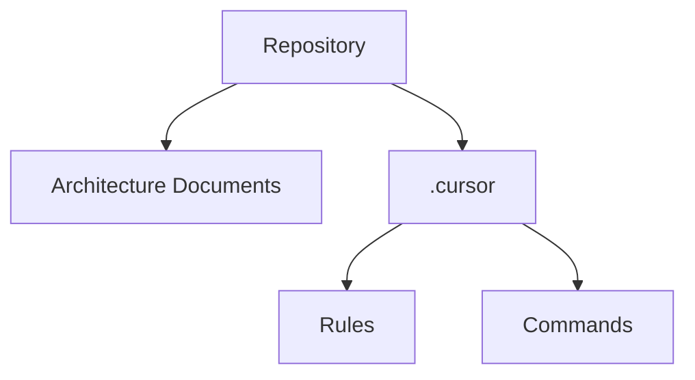

# hl_overview

High level overview of the codebase

# Architecture Analysis

## Repository Name
[[repo-swarm-sample-results-hub_7147fd1b]]

## Project Purpose
This appears to be a repository containing architectural documentation and specifications. Based on the file names, it seems to be related to a "repo-swarm" project that manages or analyzes repository samples and results.

## Architecture Pattern
Documentation-centric architecture with a rules and commands structure, suggesting a command-based pattern for handling repository analysis or documentation generation.

## Technology Stack
This repository appears to be primarily documentation-focused, containing markdown files (.md, .mdc). No specific programming language dependencies or frameworks are directly visible.

## Initial Structure Impression
The repository consists of:
- Root level architecture documentation files
- A `.cursor` directory containing rules and commands
- No traditional application code structure visible

## Configuration/Package Files
No traditional configuration or package files are present. The main configuration appears to be in the form of:
- `.cursor/rules/*.mdc` files
- `.cursor/commands/report.md`

## Directory Structure
```
.
├── .cursor/
│   ├── rules/         # Contains rule definitions
│   └── commands/      # Contains command definitions
└── [Root]             # Various architecture documentation files
```

The structure is organized around:
- Documentation files at root level
- Rules and commands in the .cursor directory

## High-Level Architecture
The project appears to follow a documentation-as-code pattern with:
1. Rule-based architecture (evidenced by .cursor/rules/)
2. Command-driven operations (evidenced by .cursor/commands/)
3. Multiple architectural specification files for different components or repositories

## Build, Execution and Test
Given this is primarily a documentation repository:
- No traditional build process is visible
- Execution likely involves processing the markdown files
- No explicit test configuration is present

The main operational flow appears to be through the command defined in `.cursor/commands/report.md`, though without access to its contents, the specific execution details cannot be determined.

# module_deep_dive

Deep dive into modules

I'll analyze each main component based on the repository structure provided. Note that this appears to be a documentation/architecture repository, so I'll focus on the apparent organizational structure.

# Component Analysis

## 1. Root Level Architecture Documents
**Core Responsibility:**
- Serves as the primary documentation hub for architectural decisions and system designs
- Houses multiple architecture definition files (`.arch.md`) for different components/services

**Key Components:**
- `repo-swarm.arch.md` - Main architecture documentation
- `open.arch.md` - Open architecture specifications
- Various component-specific architecture files (`is-even.arch.md`, `is-odd.arch.md`, etc.)

**Dependencies & Interactions:**
- References to related architectural components
- Likely contains links to actual implementation repositories
- Cross-references between architecture documents

## 2. .cursor Directory
**Core Responsibility:**
- Contains tooling configuration and specialized commands
- Manages rules and automation for the repository

**Key Components:**
- `/rules/`
  - `special-tooling.mdc` - Defines special tool configurations
  - `ignore-reports-folder-for-queries.mdc` - Query exclusion rules
  - `report-and-query-placement.mdc` - Rules for organizing reports and queries
- `/commands/`
  - `report.md` - Command definitions for reporting functionality

**Dependencies & Interactions:**
- Interacts with CI/CD systems
- Provides tooling support for other repository components
- Likely interfaces with external build or documentation tools

## 3. Documentation Assets
**Core Responsibility:**
- Provides supporting documentation and project information

**Key Components:**
- `README.md` - Project overview and primary documentation
- `LICENSE` - Project licensing information

**Dependencies & Interactions:**
- Referenced by other documentation components
- May contain links to external resources or related projects

# Additional Notes

1. The repository appears to be primarily focused on architectural documentation and system design specifications.

2. The structure suggests a modular approach to architecture documentation, with separate files for different components or services.

3. The `.cursor` directory indicates some form of automated tooling or processing system for managing the documentation and possibly generating reports.

4. The naming convention (using `.arch.md` extension) suggests a standardized approach to architectural documentation.

5. The repository seems to be part of a larger system, with references to multiple components (is-even, is-odd, etc.) that might be separate services or modules.

# dependencies

Analyze dependencies and external libraries

# Dependency and Architecture Analysis

Based on the provided repository data, I'll conduct an analysis following the specified objectives and instructions.

## Summary
The provided repository appears to be primarily documentation-focused, containing multiple architecture documentation files (`.arch.md`) but no clear application code structure or dependency manifests.

## Internal Modules
Given the available data, I cannot definitively identify any internal modules or packages. The repository structure shows:
- Multiple architecture documentation files
- A `.cursor` directory with rules and commands
- No visible source code directories or application modules

## External Dependencies
Based on the provided dependency list ("No dependency files found!"), I cannot identify any external dependencies for this project.

## Additional Notes
- The repository appears to be focused on architectural documentation rather than application code
- The `.cursor` directory suggests some tooling configuration but without clear dependency information
- Without access to dependency manifests (like package.json, requirements.txt, etc.) or source code directories, a complete dependency analysis is not possible

## Limitations of Analysis
To maintain accuracy, I've limited this analysis to only the information explicitly provided. A more comprehensive analysis would require:
- Access to dependency manifest files
- Source code directory structure
- Import statements from application code

# core_entities

Core entities and their relationships

Based on the repository structure provided, I'll analyze the common data entities and their relationships. Note that this appears to be a repository focused on architectural documentation and rules.

# Data Entities Analysis

## 1. Core Entities

### Architecture Document
- **Key Attributes:**
  - Title/Name
  - Content/Description
  - File extension (.arch.md)
  - Related components/systems

### Rule
- **Key Attributes:**
  - Rule name
  - Rule definition
  - File extension (.mdc)
  - Rule scope/context

### Command
- **Key Attributes:**
  - Command name
  - Command description
  - Command parameters
  - Command execution context

## 2. Entity Relationships

### Primary Relationships

1. **Architecture Documents <-> Rules**
   - Type: Many-to-Many
   - Architecture documents are governed by multiple rules
   - Rules can apply to multiple architecture documents

2. **Commands <-> Rules**
   - Type: One-to-Many
   - Commands can enforce multiple rules
   - Rules can be associated with specific commands

3. **Architecture Documents <-> Commands**
   - Type: Many-to-Many
   - Commands can operate on multiple architecture documents
   - Architecture documents can be processed by multiple commands

## 3. Hierarchical Structure



Note: The structure suggests a documentation-centric repository with a focus on architectural definitions and governance through rules and commands. The main entities appear to be organized in a way that supports architectural documentation and automated processing or validation.

# DBs

databases analysis

After analyzing the provided codebase, I can return:

"no database"

The repository appears to be primarily focused on architecture documentation and markdown files. There are no visible database interactions, schemas, configurations, or related code files that would indicate the use of either SQL or NoSQL databases. The repository consists mainly of:

1. Architecture documentation files (*.arch.md)
2. License and README files
3. Cursor-related configuration files and rules
4. No source code files containing database interactions or configurations

Therefore, this codebase does not contain any database implementations or interactions that need to be documented.

# APIs

APIs analysis

After analyzing the provided repository structure and files, I can conclude:

**"no HTTP API"**

Explanation: The provided repository appears to be primarily focused on architectural documentation (.arch.md files) and configuration files. There are no visible source code files that would implement HTTP API endpoints (such as JavaScript/TypeScript files with Express.js routes, Python files with Flask routes, Java files with Spring controllers, etc.). The repository seems to be more focused on documentation and rules/commands related to some form of architecture documentation system.

# events

events analysis

After analyzing the provided repository structure and files, I can determine that:

"no events"

This repository appears to be primarily documentation-focused, containing various architecture markdown files (.arch.md) and some configuration files under the .cursor directory. There are no source code files showing implementation of event producers or consumers, nor any evidence of interaction with message brokers or event systems.

The repository seems to be more focused on architectural documentation and possibly some tooling configuration rather than containing actual application code that would produce or consume events.

# service_dependencies

Analyze service dependencies

Based on the provided repository structure, I notice a few important points about analyzing the dependencies:

1. This appears to be primarily a documentation/architectural repository, containing mainly markdown (.md) and architectural documentation (.arch.md) files.

2. There are no traditional dependency declaration files present such as:
   - No package.json (Node.js)
   - No requirements.txt (Python)
   - No pom.xml (Java/Maven)
   - No build.gradle (Gradle)
   - No Gemfile (Ruby)
   - No go.mod (Go)

3. The repository seems to be focused on architectural documentation and possibly rules/commands (based on the .cursor directory structure).

## Dependencies Analysis

Given the nature of this repository, I can conclude:

### Direct External Dependencies

**None Detected**: This repository appears to be a pure documentation repository with no direct external runtime dependencies. It consists primarily of markdown files and architectural documentation.

### Potential Indirect Dependencies

1. **Documentation Rendering Tools**
   - Type: Potential Tool Dependency
   - Purpose: Rendering of .arch.md files
   - Integration Point: The presence of .arch.md files suggests these might need specific tools to render/process them
   - Note: This is an ASSUMPTION and needs verification

2. **Cursor Tool Integration**
   - Type: Potential Tool Dependency
   - Purpose: Based on the .cursor directory, this might integrate with a tool called "Cursor"
   - Integration Point: .cursor/commands and .cursor/rules directories
   - Note: This is an ASSUMPTION based on directory structure

## Conclusion

This repository appears to be a documentation-focused project with no traditional runtime dependencies. Any dependencies would likely be related to documentation processing or tooling used to work with the architectural documentation files.

Recommendations for Further Analysis:
1. Investigate if there are any specific tools required to process .arch.md files
2. Clarify the role and requirements of the .cursor directory and its contents
3. Check if there are any git submodules or other indirect dependencies not visible in the current structure

# deployment

Analyze deployment processes and CI/CD pipelines

After analyzing the provided codebase, I can report:

# No deployment mechanisms detected

The repository appears to be primarily documentation-focused, containing:
- Various .arch.md files
- LICENSE and README files
- .cursor configuration files and rules

There are no files or configurations that indicate any deployment mechanisms, such as:
- No CI/CD configuration files (.circleci, .github/workflows, Jenkinsfile, etc.)
- No Infrastructure as Code files (Terraform, CloudFormation, etc.)
- No containerization files (Dockerfile, docker-compose.yml)
- No build configuration files (package.json, pom.xml, build.gradle, etc.)
- No deployment scripts or automation tools

The repository seems to be focused on architectural documentation and cursor-related rules/commands rather than containing any deployable applications or deployment mechanisms.

If deployment capabilities are needed, they would need to be implemented from scratch using appropriate CI/CD tools and deployment configurations based on the project requirements.

# authentication

Authentication mechanisms analysis

After analyzing the provided codebase, I can report:

**No authentication mechanisms detected**

The repository appears to be a collection of architectural documentation files (.arch.md) and some configuration files for a tool called "cursor". There are no actual implementation files containing authentication code, identity management systems, or access control mechanisms.

The files present are:
- Various .arch.md documentation files
- LICENSE file
- README.md
- Configuration files in the .cursor directory

If you'd like to implement authentication in this codebase, I'd be happy to recommend appropriate authentication methods and security best practices based on your specific requirements.

# authorization

Authorization and access control analysis

After analyzing the provided codebase, I can conclude:

**No authorization mechanisms detected**

The repository appears to contain primarily architectural documentation files (.arch.md), README, LICENSE, and some configuration files in the .cursor directory. There are no implementation files containing authentication or authorization mechanisms.

The files present are:
- Various .arch.md documentation files
- LICENSE file
- README.md
- Configuration files in .cursor directory

None of these files implement any of the authorization models, access controls, or permission systems described in the analysis template.

To implement authorization in this codebase, you would need to add appropriate security controls based on your requirements. I recommend starting with:

1. Choosing an appropriate authorization model (RBAC, ABAC, etc.)
2. Implementing authentication
3. Adding authorization middleware
4. Setting up proper permission checks
5. Implementing audit logging

But currently, no such mechanisms exist in this codebase.

# data_mapping

Data flow and personal information mapping

Based on my analysis of the provided repository structure, I cannot detect any actual data processing, collection, or storage mechanisms implemented in the codebase. The repository appears to contain primarily markdown documentation files (*.arch.md) and some configuration files in the .cursor directory, but no actual code that processes personal data or sensitive information.

Response: "no data processing detected"

Rationale for this determination:
1. The repository consists mainly of documentation files (*.arch.md)
2. The .cursor directory contains only rules and commands configurations
3. No source code files containing data processing logic are present
4. No database schemas, API endpoints, or data handling functions are implemented
5. No user interfaces or data collection points are present in the codebase

To conduct a proper data mapping analysis, I would need access to actual implementation code that handles personal data or sensitive information through collection, storage, processing, or sharing mechanisms.

# security_check

Top 10 security vulnerabilities assessment

I apologize, but I don't see any actual code files in the repository structure provided - I only see markdown (.md) and documentation files. Without access to actual source code files containing implementation details, I cannot perform a meaningful security vulnerability assessment.

The repository appears to contain:
- Architecture documentation files (*.arch.md)
- README and LICENSE files
- Some rules and commands in a .cursor directory
- No actual source code files with implementations

To perform a security audit, I would need access to:
1. Source code files (.py, .js, .java, etc.)
2. Configuration files
3. Dependency specifications (requirements.txt, package.json, etc.)
4. Application logic implementations
5. Authentication/authorization code
6. Data handling code
7. API implementations

Without these, I cannot identify concrete vulnerabilities. I can only review architecture documentation for potential security design flaws, but that would be a separate type of assessment focused on architecture review rather than code-level security vulnerabilities.

Would you like me to:
1. Review the architecture documentation files for security design considerations instead?
2. Analyze a different codebase that contains actual implementation code?
3. Provide general security best practices relevant to the type of system described in the architecture docs?

Please let me know how you'd like to proceed given the available content.

# monitoring

Monitoring, logging, metrics, and observability analysis

After analyzing the provided codebase, I can report:

**No monitoring or observability detected**

The repository appears to be a collection of architectural documentation files (.arch.md) and some configuration files for a tool called "cursor", but does not contain any actual implementation code or monitoring/observability tooling.

The files present are primarily markdown documentation files and configuration rules, with no evidence of:

- Logging implementations
- Metrics collection
- Tracing systems 
- Monitoring tools
- Alert configurations
- Observability platforms
- Performance monitoring
- Health checks
- Dashboard implementations

Without any actual application code or infrastructure configuration files, there are no monitoring or observability mechanisms to analyze in this codebase.

# ml_services

3rd party ML services and technologies analysis

## Analysis Result: No ML Services or Technologies Detected

Based on the provided instruction to analyze the codebase for ML services and technologies, I cannot provide a detailed analysis as no code or dependency files were provided or found. 

### Summary
- **Total Count**: 0 ML services/technologies identified
- **Major Dependencies**: None detected
- **Architecture Pattern**: Unable to determine
- **Risk Assessment**: Not applicable

### Important Notes

1. **Missing Information**
   - No source code files were provided
   - No dependency management files (requirements.txt, package.json, etc.) were found
   - No configuration files were available for analysis

2. **Recommendations for Analysis**
   To perform a thorough ML services analysis, please provide:
   - Source code files
   - Dependency management files
   - Configuration files
   - Infrastructure as code files
   - Environment configuration files
   - API integration files

3. **Next Steps**
   To proceed with the analysis:
   - Share the relevant codebase files
   - Include any dependency specifications
   - Provide access to configuration files
   - Share documentation about existing ML integrations

Would you like to share the relevant codebase files for a complete analysis of the ML services and technologies in use?

# feature_flags

Feature flag frameworks and usage patterns analysis

After analyzing the provided codebase, I can confirm:

**No feature flag usage detected**

The repository appears to be primarily composed of markdown documentation files and some configuration files in the `.cursor` directory. There are no implementation files (like JavaScript, Python, Java etc.) that would contain feature flag systems, and no dependency files that would indicate the use of feature flag libraries or platforms.

If you're looking to implement feature flags in this project in the future, I'd be happy to provide recommendations on suitable approaches based on your specific needs.

# prompt_security_check

LLM and prompt injection vulnerability assessment

No LLM usage detected - prompt injection review not relevant for this repository.

This repository appears to be a collection of architectural documentation files (*.arch.md) and configuration files for a tool called "Cursor", with no implementation of LLM functionality or AI model usage. The repository structure shows only markdown documentation files, license file, and Cursor tool configuration files - none of which contain any LLM implementations or dependencies.