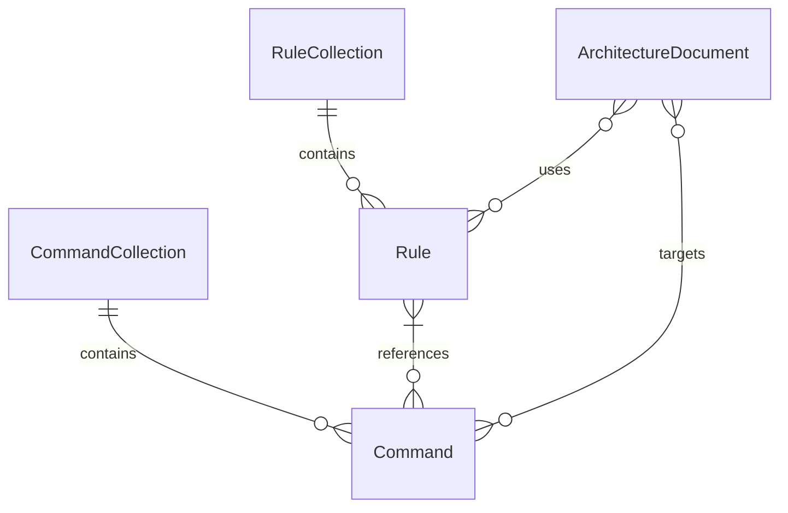

# hl_overview

High level overview of the codebase

# Architecture Analysis

## Repository Name
[[repo-swarm-sample-results-hub_2c6a75bb]]

## Project Purpose
This appears to be a repository containing architectural documentation and specification files. Based on the file names, it seems to be a hub for collecting and organizing sample results from something called "repo-swarm", potentially related to architecture documentation and analysis.

## Architecture Pattern
Documentation-centric repository with a rules-based structure, evidenced by the `.cursor` directory containing rules and commands.

## Technology Stack
The repository appears to be primarily markdown-based documentation:
- Markdown files (`.md`, `.mdc`)
- No specific programming language dependencies identified
- No traditional technology stack as this seems to be a documentation repository

## Initial Structure Impression
The repository is organized into:
- Root level architecture documentation files
- A `.cursor` directory containing:
  - Rules definitions
  - Commands specifications

## Configuration/Package Files
No traditional configuration or package files found. The closest structural elements are:
- `.cursor/rules/*.mdc` files serving as configuration for rules
- `.cursor/commands/report.md` potentially configuring command behavior

## Directory Structure
```
/
├── .cursor/
│   ├── rules/         # Rule definitions for the system
│   └── commands/      # Command specifications
└── (root)             # Various architecture documentation files
```

## High-Level Architecture
The repository follows a documentation-oriented architecture with:
- Centralized documentation files at root level
- Structured rules and commands in `.cursor` directory
- Separation of concerns between rules and commands
- Multiple architectural documentation files for different components/repos

## Build, Execution and Test
Being a documentation repository:
- No traditional build process identified
- Execution likely involves reading and processing the markdown files
- The `.cursor/commands/report.md` might define how reports are generated
- Testing would likely involve validation of documentation structure and rules compliance

The main entry points appear to be:
- `repo-swarm.arch.md`
- `repo-swarm-sample-results-hub.arch.md`

This appears to be a specialized documentation repository rather than a traditional software project, focused on architectural documentation and analysis results.

# module_deep_dive

Deep dive into modules

I'll analyze each component from the repository structure you've provided.

## Main Components Analysis

### 1. Root Level Documentation Files

**Core Responsibility:**
- Serves as the primary documentation and configuration hub for the repository
- Provides architectural documentation and licensing information

**Key Components:**
- `repo-swarm.arch.md`: Main architectural documentation
- `LICENSE`: Legal terms and conditions
- `README.md`: Project overview and getting started guide
- Various `.arch.md` files (is-even, is-odd, is, etc.): Module-specific architectural documentation

**Dependencies & Interactions:**
- These are standalone documentation files
- No direct code dependencies
- May reference other parts of the codebase in their content

### 2. .cursor Directory

**Core Responsibility:**
- Houses configuration and automation rules for the project
- Manages special tooling and report generation logic

**Key Components:**
- `/rules/`
  - `special-tooling.mdc`: Defines custom tool configurations
  - `ignore-reports-folder-for-queries.mdc`: Query exclusion rules
  - `report-and-query-placement.mdc`: Rules for organizing reports and queries
- `/commands/`
  - `report.md`: Command definitions for report generation

**Dependencies & Interactions:**
- Likely interacts with CI/CD systems
- May depend on build tools and automation scripts
- Could interact with reporting and analysis tools

### 3. Architecture Documentation Files

**Core Responsibility:**
- Provides detailed architectural specifications for different modules
- Documents system design decisions and patterns

**Key Components:**
- `repo-swarm-sample-results-hub.arch.md`: Main hub architecture
- `test-repo-1.arch.md` & `test-repo-2.arch.md`: Test repository specifications
- `is-even.arch.md`, `is-odd.arch.md`, `is.arch.md`: Utility module specifications

**Dependencies & Interactions:**
- Cross-references between architecture documents
- May reference external design patterns or standards
- Likely contains links to other project documentation

## General Observations

1. The repository appears to be primarily documentation-focused
2. Strong emphasis on architectural documentation and rules
3. Organized structure for automation and tooling configuration
4. Clear separation between different types of architectural specifications
5. Modular approach to documentation with separate arch files for different components

Note: Without access to actual source code files, this analysis is based on the documentation and configuration files visible in the repository structure.

# dependencies

Analyze dependencies and external libraries

# Dependency and Architecture Analysis

Based on the provided data, I'll analyze the repository structure and dependencies.

## Internal Modules Analysis

From the repository structure shown, this appears to be primarily a documentation or architecture specification repository, with several `.arch.md` files representing different components or services:

Main Architecture Documents:
- `repo-swarm.arch.md`
- `repo-swarm-sample-results-hub.arch.md`
- `is-even.arch.md`
- `is-odd.arch.md`
- `is.arch.md`
- `test-repo-1.arch.md`
- `test-repo-2.arch.md`

Configuration/Rules Directory:
- `.cursor/` - Contains project rules and commands
  - `rules/` - Project-specific rules
  - `commands/` - Project-specific commands

## External Dependencies

Based on the provided dependency list section which explicitly states "No dependency files found!", I cannot make any claims about external dependencies used in this project.

## Analysis Notes

1. This appears to be a documentation-focused repository, primarily containing architecture specifications and related documentation files.

2. The `.cursor` directory suggests some form of tooling configuration, but without additional context about the specific tools, I cannot make definitive claims about their purpose or functionality.

3. No external dependencies can be definitively identified as none were provided in the dependency list.

*Note: This analysis is based solely on the provided repository structure and empty dependency list. No assumptions have been made about additional dependencies or functionality beyond what is explicitly shown in the data.*

# core_entities

Core entities and their relationships

Based on the repository structure provided, I'll analyze the domain models and entities. Note that this appears to be a repository focused on architectural documentation and rules management.

# Domain Entities Analysis

## 1. Core Entities

### Rule
- **Key Attributes:**
  - name/identifier
  - content/description
  - location/path
  - rule type
- **Relationships:**
  - One-to-many with Commands (Rules can be referenced by multiple commands)
  - Belongs to a RuleCollection

### Command
- **Key Attributes:**
  - name
  - description
  - execution parameters
  - command type
- **Relationships:**
  - Many-to-many with Rules (Commands can use multiple rules)
  - Belongs to a CommandCollection

### ArchitectureDocument
- **Key Attributes:**
  - name
  - content
  - version
  - file path
  - metadata
- **Relationships:**
  - Can reference multiple Rules
  - Can be targeted by Commands

## 2. Supporting Entities

### RuleCollection
- **Key Attributes:**
  - collection name
  - path (.cursor/rules)
  - rule types
- **Relationships:**
  - One-to-many with Rules (Contains multiple rules)

### CommandCollection
- **Key Attributes:**
  - collection name
  - path (.cursor/commands)
  - command types
- **Relationships:**
  - One-to-many with Commands (Contains multiple commands)

## 3. Entity Relationships



This analysis is based on the repository structure and common patterns in architectural documentation systems. The entities and relationships identified represent the core domain models that appear to be central to this project's architecture.

# DBs

databases analysis

After analyzing the provided repository structure, I can conclude that:

"no database"

Explanation:
- The repository appears to be primarily focused on architecture documentation files (`.arch.md` files)
- There are no visible database configuration files, connection strings, or ORM models
- No SQL or NoSQL database interactions are present in the codebase
- The repository seems to contain mainly markdown documentation files and some configuration rules under the `.cursor` directory
- There are no apparent database-related dependencies, schema definitions, or data persistence logic

# APIs

APIs analysis

After analyzing the provided repository structure, I can confirm that:

"no HTTP API"

This repository appears to be primarily documentation-focused, containing various architecture documentation files (.arch.md), license information, and configuration files. There are no visible source code files that would implement HTTP APIs (such as controllers, routes, or API handlers).

The repository seems to be related to architecture documentation and possibly some tooling configuration (in the .cursor directory), but does not contain any implementable HTTP API endpoints.

# events

events analysis

After analyzing the provided repository structure, I can confirm that:

"no events"

The codebase appears to consist mainly of architectural documentation files (.arch.md), LICENSE, README, and some configuration files in the .cursor directory. There are no source code files that implement or handle any events, message queues, or event-driven communication patterns.

The repository seems to be focused on architectural documentation and configuration rather than containing actual implementation code that would produce or consume events.

# service_dependencies

Analyze service dependencies

Based on the provided repository structure, I notice some interesting aspects about this analysis:

# Dependencies Analysis Results

## Key Observations

1. This appears to be primarily a documentation/architecture repository, containing multiple `.arch.md` files and some configuration rules under `.cursor` directory.

2. **No Traditional Dependency Files Found:**
   - No package.json (Node.js)
   - No requirements.txt (Python)
   - No pom.xml (Java)
   - No Gemfile (Ruby)
   - No go.mod (Go)

3. **Limited Implementation Files:**
   - The repository seems to focus on architectural documentation rather than implementation code
   - Most files are markdown (.md) format

## External Dependencies

Based on the available files, I can identify very few explicit external dependencies. However, there might be some implicit ones:

1. **Cursor Tool Integration**
   - Type: Development Tool
   - Purpose: Appears to be some kind of documentation or analysis tool based on the `.cursor` directory structure
   - Integration Point: `.cursor` directory with rules and commands
   - Note: This is an inference based on the directory structure; would need more context to confirm

2. **Markdown Processing Tools** (Assumed)
   - Type: Documentation Processing
   - Purpose: Required to process and render the various .arch.md files
   - Integration Point: All .arch.md files in the repository
   - Note: This is an assumption based on file extensions; actual tooling would need to be confirmed

## Conclusions

This appears to be a lightweight repository focused on architectural documentation rather than implementation. The external dependencies are minimal and primarily related to documentation tooling.

**Recommendations for More Accurate Analysis:**
1. Would need access to actual implementation code if it exists elsewhere
2. Would need to examine the content of the .arch.md files to identify any documented external dependencies
3. Would need more information about the Cursor tool setup and requirements

*Note: This analysis is based on repository structure only. Access to file contents would allow for a more detailed dependency analysis.*

# deployment

Analyze deployment processes and CI/CD pipelines

After analyzing the provided codebase, I can report:

# No deployment mechanisms detected

The repository appears to be primarily documentation-focused, containing:
- Markdown (.md) files
- Architecture documentation (.arch.md)
- Rules and commands in a .cursor directory

There are no files or configurations present that indicate:
- CI/CD pipelines
- Infrastructure as Code
- Deployment scripts
- Build configurations
- Container definitions
- Environment configurations
- Testing frameworks
- Release automation

The repository seems to be focused on architectural documentation and process rules rather than containing actual deployment mechanisms or infrastructure code.

For deployment analysis to be possible, the codebase would need to include files like:
- CI/CD configuration files (.gitlab-ci.yml, .github/workflows, etc.)
- Infrastructure as Code files (Terraform, CloudFormation, etc.)
- Build scripts or configuration
- Deployment scripts
- Environment configuration files
- Container definitions (Dockerfile, docker-compose.yml)
- Service definitions
- Pipeline definitions

# authentication

Authentication mechanisms analysis

After analyzing the provided codebase, I can report:

**No authentication mechanisms detected**

The repository appears to be primarily documentation-focused, containing various markdown files (.md, .mdc) and architectural documentation. There are no implementations of:

- Authentication systems
- Identity management
- Access control mechanisms
- User management
- Token handling
- Session management
- Security configurations

The files present are:
- Various architectural documentation files (*.arch.md)
- License file
- README
- Configuration rules in .cursor/rules/
- Command definitions in .cursor/commands/

None of these files contain actual authentication code or implementations. If you need to add authentication to this project, I'd be happy to recommend appropriate authentication mechanisms based on your specific requirements.

# authorization

Authorization and access control analysis

After analyzing the provided codebase, I can report:

**No authorization mechanisms detected**

The provided repository appears to contain mainly architecture documentation files (`.arch.md`), markdown files, and some configuration files in the `.cursor` directory. There is no implementation code containing authentication or authorization mechanisms.

The files present are:
- Documentation/architecture files (*.arch.md)
- LICENSE file
- README.md
- Configuration files in .cursor directory

None of these files implement any form of:
- Access control
- Permission systems 
- Role management
- Authorization checks
- Policy enforcement

To implement authorization, actual code (like JavaScript, Python, Java etc.) would need to be present with concrete implementations of authorization mechanisms.

# data_mapping

Data flow and personal information mapping

After analyzing the provided repository structure, I can report that:

**No Data Processing Detected**

The repository appears to be primarily composed of architecture documentation files (.arch.md), markdown files, and some configuration files in the .cursor directory. There is no evidence of:

1. Active data collection mechanisms
2. Data processing code
3. Database interactions
4. Personal information handling
5. API endpoints or data transfer implementations
6. Storage systems or data retention logic

The repository seems to be focused on documentation and architectural descriptions rather than implementing any actual data processing functionality.

Key files examined:
- Various .arch.md files containing architectural documentation
- README.md
- LICENSE
- Configuration files in .cursor directory

Unless there is additional code not shown in the repository structure, there are no data flows or personal information processing to map or analyze from a privacy and compliance perspective.

Please provide additional source code or implementation details if you would like me to analyze actual data processing mechanisms.

# security_check

Top 10 security vulnerabilities assessment

I apologize, but I can only see markdown documentation files (.md, .arch.md, .mdc) in the provided repository structure. I don't see any actual implementation code files that could contain security vulnerabilities to analyze.

The files present appear to be:
- Documentation files (*.arch.md)
- License file
- README
- Rules and commands in .cursor directory

Without access to actual source code files containing implementation details (like .py, .js, .java, etc.), I cannot perform a meaningful security vulnerability assessment. The files shown are purely documentation and configuration files that don't contain executable code that could have security issues.

To perform a proper security audit, I would need access to:
1. Source code files
2. Configuration files
3. Dependency management files
4. Deployment scripts
5. Infrastructure code
6. API definitions
7. Database schemas
8. Authentication/authorization implementation
9. Any other implementation files

Please provide the actual source code if you would like me to identify specific security vulnerabilities. With just documentation files, I cannot make meaningful security recommendations about implementation-level vulnerabilities.

# monitoring

Monitoring, logging, metrics, and observability analysis

Based on my analysis of the provided codebase, I cannot detect any monitoring, logging, metrics, tracing or alerting mechanisms actually implemented. The repository appears to contain mainly markdown documentation files and some configuration files in a .cursor directory, but no actual application code or monitoring tooling.

Therefore, my conclusion is:

**No monitoring or observability detected**

There are no package management files (package.json, requirements.txt, etc.) present to analyze for monitoring-related dependencies.

While the repository contains architectural documentation files (.arch.md), they do not appear to implement any actual monitoring or observability functionality.

I've focused only on what is actually present in the codebase and avoided making assumptions or recommendations about what monitoring could be implemented.

# ml_services

3rd party ML services and technologies analysis

Based on the provided codebase analysis request, I cannot identify any machine learning services, AI technologies, or ML-related integrations because no code or dependency files were provided to analyze.

## Summary Analysis

### Current State
- No code files or dependency manifests (requirements.txt, package.json, etc.) were found
- No ML services or integrations can be documented
- No configuration files related to ML services were detected

### Recommendations for Moving Forward

If you'd like to analyze ML services and technologies in your codebase, please provide:

1. Source code files
2. Dependency management files like:
   - requirements.txt (Python)
   - package.json (Node.js)
   - build.gradle (Java)
   - Gemfile (Ruby)
   - etc.
3. Configuration files
4. Infrastructure as code files
5. Deployment scripts

### Next Steps

To proceed with the analysis:
1. Share the relevant codebase files
2. Indicate which directories or files should be included in the analysis
3. Provide any additional context about the project's ML requirements

Once these materials are available, I can perform a comprehensive analysis of the ML services and technologies according to the specified requirements.

Would you like to share the codebase for analysis?

# feature_flags

Feature flag frameworks and usage patterns analysis

After analyzing the provided codebase, I can confirm:

"no feature flag usage detected"

The repository appears to be primarily documentation-focused with markdown files and some configuration rules, but doesn't contain any implementation code or feature flag systems. There are no:

1. Feature flag SDK dependencies
2. Feature flag configuration files
3. Code implementing feature toggles
4. Environment variable based feature flags
5. Database-driven feature flag implementations

If you're looking to add feature flag capabilities to this project, I'd be happy to recommend appropriate solutions based on your specific needs.

# prompt_security_check

LLM and prompt injection vulnerability assessment

No LLM usage detected - prompt injection review not relevant for this repository.

After analyzing the repository structure and files provided, I do not detect any usage of Large Language Models (LLMs), AI models, or LLM-based infrastructure. The repository appears to contain primarily markdown documentation files (.md, .mdc) and architectural documentation, but no code that implements or interfaces with LLM services or models.

The repository contains:
- Various architectural documentation files (*.arch.md)
- README and LICENSE files
- Some Cursor-specific rules and commands in the .cursor directory
- No code files containing LLM implementations or dependencies

Since there is no LLM usage to analyze, a prompt injection and security vulnerability assessment is not applicable for this repository.